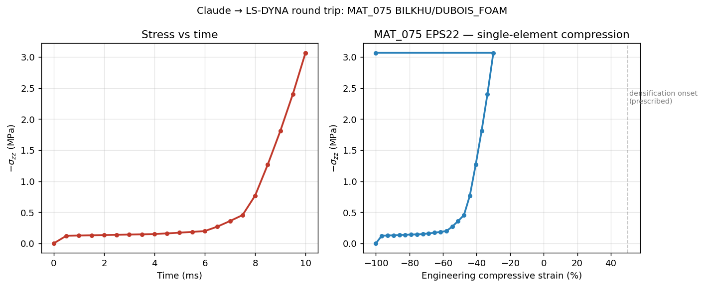

# lsdyna-agent-test

Tooling for **driving LS-DYNA from Claude / Python end-to-end** on a Windows machine with the free Ansys Student + LS-DYNA Suite Student licenses.

Built and validated on 2026-05-02 → 2026-05-03 from a research session that started with "can Claude actually run LS-DYNA?" and ended with two working stacks:

- **Stack A — Headless solver loop**: hand-authored `.k` decks → standalone solver → `d3plot`/`elout` parsing in Python. Fast iteration. Workhorse for material verification.
- **Stack B — Mechanical-via-Workbench bridge**: a running Workbench session + PyWorkbench + PyMechanical lets Python drive the Mechanical GUI in real time. Visible model construction, `.k` export.



*Stress-strain curve from `run02/`: MAT_075 BILKHU/DUBOIS_FOAM, EPS22-like, single-hex compression. Yield ~0.13 MPa, plateau, densification onset at ~50% strain. Stack A round-trip from `.k` → solver → `lasso-python` → matplotlib.*

## Why this exists

LLM operators for FEA are an active 2024–2025 research area — Abaqus, FEniCS, Elmer, and CalculiX all have published "LLM writes input deck and runs the solver" papers (FeaGPT, ALL-FEM, AutoFEA, FEA_Assisted_Agent). **LS-DYNA does not, despite being one of the most-used explicit-dynamics solvers in industry.** This repo is the working stack that closes that gap for a single user (so far).

## Two surprises worth knowing about

1. **`PyDYNA`'s WindowsRunner doesn't work with the LSTC standalone Student install.** It hard-codes a search for `lsprepost*/LS-Run/lsdynamsvar.bat` next to the solver — that file exists in Ansys-Unified bundles but not in the standalone install most people actually download. `lsdyna_runner.py` is a 50-line subprocess shim that bypasses this. Worth a github issue against `ansys/pydyna`.

2. **`PyMechanical.launch_mechanical()` triggers a different license check than the Workbench Toolbox.** On Ansys Student, `Model.AddLSDynaAnalysis()` is blocked when called against a PyMechanical-launched session, but the same call succeeds when called against a Mechanical instance that Workbench launched. The difference is the env-var bridge (`ANSYS_LSW_*`) that the LSTC standalone installer sets up — Workbench reads it, PyMechanical's standalone launcher doesn't. **PyWorkbench → start_mechanical_server → PyMechanical.connect_to_mechanical** is therefore the only path from Python on Student licensing.

## Quickstart

See `CLAUDE.md` for the architecture and conventions, `mech/README.md` for the exact Workbench-bridge bootstrap recipe.

```bash
PY=/c/ProgramData/anaconda3/python.exe

# Run the demo MAT_075 EPS22 single-hex compression
$PY lsdyna_runner.py rigs/uniaxial_unconfined/rig_template.k run-demo/

# Parse results
$PY parse_results.py run-demo/

# Plot
$PY plot_foam_curve.py
```

## Status

✅ Working: Stack A solver round-trip; Stack B Mechanical-via-Workbench connection
🟡 Skeleton: material cards for MAT_063, MAT_077; verify-loop runner; LS-PrePost launcher
⚪ Not started: MAT_079, MAT_145; real EPS001-014 curves into MAT_075; LS-DYNA MCP server

## License

(TBD — research/personal use)
